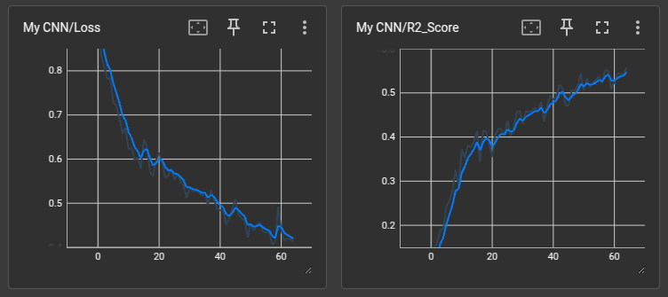
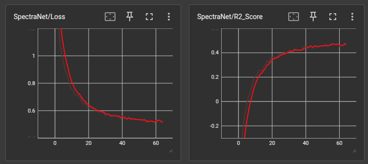

# Predicting soil properties with Near Infra-red waves

## What has been done

I implemented a quite large CNN to predict the properties of the soil, my architecture consists in:
- Convolutional Layer with 32 filters and a kernel size of 4 plus a batch norm, this was done twice;
- A max pooling layer to reduce memory usage;
- Repeat the process twice;
- Two linear layers containing batch norm and dropout;
- A single linear layer containing only dropout;
- Finally the output layer;

I also compared my architechture to a slightly changed version of the spectra net proposed by Zeit AI

# Results

My approach, in average, returned a MSE loss of 0.33 and a R2 score of 0.62, while the spectra net 
only achieved a MSE loss of 0.51 and a R2 score of 0.46. The difference is due to the simplicity 
of Spectra net (because it was not designed to predict this amount of features)

## Chart comparison between those 2 architectures using tensorboard

### My proposed cnn

### Spectra Net

